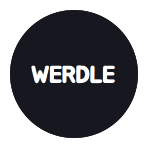

<!-- TITLE -->
<div align="center">

<p>
<h1>Werdle</h1>
<p>App description
</p>

<p>Built with <a href="https://reactjs.org/">React</a> + <a href="https://redux.js.org/">Redux</a>, CSS</a>/<a href="https://sass-lang.com/">Sass</a>, and hosted with <a href="https://www.netlify.com/">Netlify</a></p>

<b><a href="" target="_blank">
» View Live Site «
</a></b>


</div>

<!-- INTRODUCTION -->

## 📚 Introduction

<b>[App Name](http://google.ca)</b> is....

<!-- FEATURES -->

## ⭐ Features

- Feature 1
- Feature 2

<!-- INSTALLATION -->

## 🛠 Installation

The project is live
<b><a href="http://pomomilk.com/" target="_blank">here</a></b>, but if you would prefer a local installation:

1. Clone or download this repository
   ```
   git clone https://github.com/ahhreggi/werdle
   ```
2. Navigate to the project directory and install dependencies
   ```
   cd appdirectory
   npm install
   ```
3. Launch the development web server
   ```
   npm start
   ```
4. Visit <a href="http://localhost:3000/">http://localhost:3000/</a> on your browser

## 📷 Screenshots
