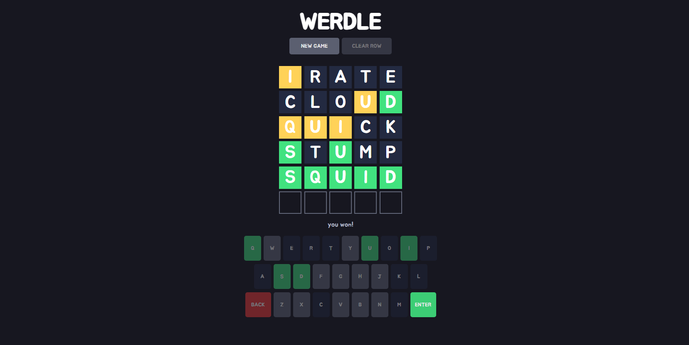

<!-- TITLE -->
<div align="center">

<p>
<h1>Werdle</h1>
<p>A Wordle clone
</p>

<p>Built with <a href="https://reactjs.org/">React</a>, CSS</a>/<a href="https://sass-lang.com/">Sass</a>, and hosted with <a href="https://www.netlify.com/">Netlify</a></p>

<b><a href="https://ahhreggi-werdle.netlify.app" target="_blank">
» View Live Site «
</a></b>



</div>

<!-- INTRODUCTION -->

## 📚 Introduction

<b>[Werdle](http://ahhreggi-werdle.netlify.app)</b> is a replayable Wordle clone. Try to guess the secret word in 6 tries or less. Green squares indicate that a letter is in the word and in the correct position. Yellow squares mean that the letter is in the word, but in the wrong spot. Enjoy!

<!-- INSTALLATION -->

## 🛠 Installation

The project is live
<b><a href="http://ahhreggi-werdle.netlify.app" target="_blank">here</a></b>, but if you would prefer a local installation:

1. Clone or download this repository
   ```
   git clone https://github.com/ahhreggi/werdle
   ```
2. Navigate to the project directory and install dependencies
   ```
   cd werdle
   npm install
   ```
3. Launch the development web server
   ```
   npm start
   ```
4. Visit <a href="http://localhost:3000/">http://localhost:3000/</a> on your browser
